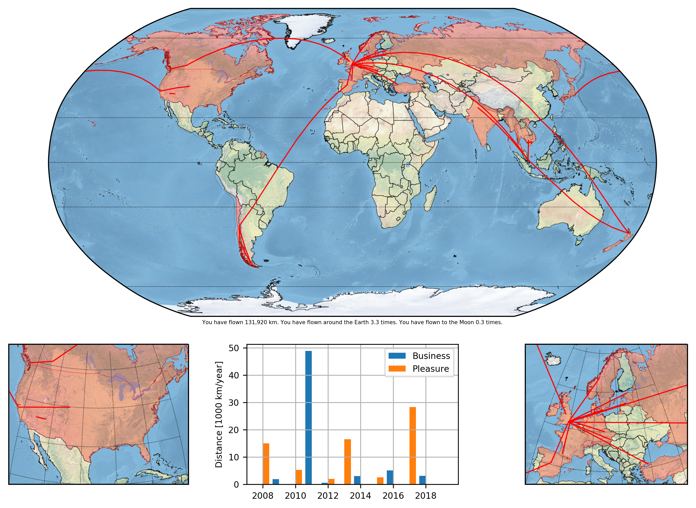

  

# Flight Map Creator (FMC)

This Python 3.x module contains all the functions required to create a map of the world with all of your flights overlaid and all of the countries that you have visited shaded in. It also contains an [example input file](example.csv) so that you know what is required to make it work too. The format for a line is `departure airport IATA code`, `arrival airport IATA code`, `year of flight`, `Business`/`Pleasure`. Whilst the flights do not have to be in order in the CSV file the first flight *does* have to have occurred in the first year (if you don't pass `minYear`).

## Installation

To install FMC, run:

```sh
# To install the latest development version from GitHub:
pip install --user git+https://github.com/Guymer/fmc.git
```

... and everything should "just work".

## Usage

FMC can be run very easily, below is an example (also found in [example.py](example.py)).

```python
#!/usr/bin/env python3

# Import modules ...
import fmc

# Run function ...
fmc.run(
    "example.csv",
             debug = False,
    extraCountries = [                  # These are extra countries that you
        "Denmark",                      # have visited but which you have not
        "Germany",                      # flown to (e.g., you took a train).
        "Ireland",
        "Myanmar",
        "Nepal",
        "Netherlands",
        "Russia",
        "Switzerland",
    ],
        notVisited = [                  # These are countries which you have
        "Hong Kong",                    # flown to but not visited (e.g., you
        "Singapore",                    # just transferred planes).
    ],
           renames = {                  # (see documentation below)
                                        #           airport database → shape database
                                                           "Türkiye" : "Turkey",
        "United Kingdom of Great Britain and Northern Ireland (the)" : "United Kingdom",
                                    "United States of America (the)" : "United States of America",
                                                          "Viet Nam" : "Vietnam",
    }
)
```

You must pass it the path to a CSV file containing all of the flights that you have taken. Additionally, you can optionally pass it a list of other countries that you have visited but that you might not have flown to (`extraCountries`). Furthermore, you can optionally pass it a list of countries that you have **not** visited, such as those containing transfer airports (`notVisited`).

FMC uses two different databases of countries behind the scenes and (very annoyingly) they use different names for some countries. If any of these are ones that you have visited then you can correct FMC's behaviour by explicitly providing a dictionary of countries to be renamed (`renames`). To find out the list of country names supported by the airport database then look at ["db.json"](fmc/db.json). To find out the list of country names supported by the shape database then look at ["Natural Earth Countries.json" in my "misc" repository](https://github.com/Guymer/misc/blob/main/Natural%20Earth%20Countries.json).

## Example Output

FMC will create a PNG in the directory of the CSV file. Below is the result for the included file [example.csv](example.csv).



If you would like to colour the great circles and the countries by the purpose of the flights/visits then you can pass the optional argument `colorByPurpose = True`, which will produce the below result:


FMC will also print out a list of countries which it thinks that you have visited, so that you can fine tune your usage of `extraCountries`, `notVisited` and `renames`.

## Dependencies

FMC requires the following Python modules to be installed and available in your `PYTHONPATH`.

* [cartopy](https://pypi.org/project/Cartopy/)
* [matplotlib](https://pypi.org/project/matplotlib/)
* [pyguymer3](https://github.com/Guymer/PyGuymer3)

FMC uses some [Global Self-Consistent Hierarchical High-Resolution Geography](https://www.ngdc.noaa.gov/mgg/shorelines/) resources and some [Natural Earth](https://www.naturalearthdata.com/) resources via the [cartopy](https://pypi.org/project/Cartopy/) module. If they do not exist on your system then [cartopy](https://pypi.org/project/Cartopy/) will download them for you in the background. Consequently, a working internet connection may be required the first time you run FMC.

## To Do

* The `useNaturalEarthAirports` branch will likely remain un-merged forever. Due to an [open issue in Natural Earth](https://github.com/nvkelso/natural-earth-vector/issues/203), many major airports are missing from the Shape file. The ticket has been open since July 2017 and shows no sign of being closed.
